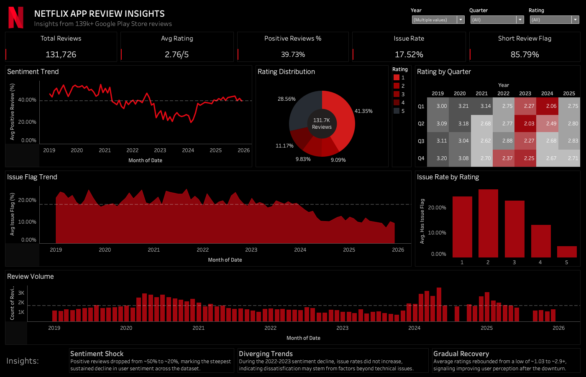

# Netflix Review Analysis System

Sentiment analysis and business intelligence system built on 142,000+ Netflix Google Play Store reviews. Combines NLP-based classification with an interactive web app and a Tableau dashboard to surface actionable product insights.

---

## Live Demo

| Tool | Link |
|------|------|
| Hugging Face App | [Netflix Review Analyser](https://huggingface.co/spaces/rajvikapadia/netflix-review-analyser) |
| Tableau Dashboard | Preview below (workbook included in `/tableau`) |

### Dashboard Preview


---

## Results

| Metric | Value |
|--------|-------|
| Dataset size | 142,000+ reviews |
| Model | Logistic Regression + TF-IDF |
| F1 Macro | **0.84** |
| F1 Negative | 0.82 |
| F1 Positive | 0.86 |

---

## Project Structure

```
Netflix Review Analysis/
├── netflix_sentiment_analysis.ipynb   # Full analysis notebook
├── app.py                             # Gradio web app (Hugging Face deployment)
├── requirements.txt                   # Dependencies
├── data/
│   └── netflix_reviews_bi.csv         # BI-ready export for Tableau
└── tableau/
    ├── netflix_dashboard.twbx         # Tableau workbook
    └── dashboard_screenshot.png       # Dashboard preview
```

---

## What's Inside

### 1. Sentiment Classification
- Binary classification: positive (rating ≥ 4) vs negative
- Text preprocessing: lowercasing, punctuation removal, lemmatization, custom stopwords
- Features: TF-IDF (1000 features, unigrams + bigrams) + review length (MinMax scaled)
- Four models benchmarked: Logistic Regression, Naive Bayes, Linear SVM, Random Forest
- Hyperparameter tuning via 5-fold GridSearchCV on Logistic Regression
- Best model: Logistic Regression (C=1, liblinear solver) — F1 Macro 0.84

### 2. EDA & Text Analysis
- Rating distribution and sentiment trend over time
- Review length analysis by sentiment
- TF-IDF word clouds and keyword bar charts for positive and negative subsets

### 3. Web App (Hugging Face Spaces)
- **Sentiment Predictor tab:** Classifies any custom review in real time
- **AI Review Summarizer tab:** Samples N reviews by sentiment and generates a structured business summary using Llama 3.3 70B via Groq API

### 4. BI Dashboard (Tableau)
Single-page dashboard covering:
- KPI tiles — total reviews, avg rating, positive review %, issue rate, short review flag rate
- Sentiment trend line chart with monthly granularity (2019–2026)
- Rating distribution donut chart
- Rating by quarter heatmap
- Issue flag trend over time
- Issue rate by rating bar chart
- Review volume bar chart
- Bottom-line insights: Sentiment Shock, Diverging Trends, Gradual Recovery

---

## Tech Stack

| Category | Tools |
|----------|-------|
| Language | Python |
| NLP / ML | scikit-learn, TF-IDF |
| Data | pandas, numpy |
| Visualization | matplotlib, seaborn, WordCloud |
| Web App | Gradio, Hugging Face Spaces |
| AI Summarization | Groq API, Llama 3.3 70B |
| BI | Tableau (via BI CSV export) |

---

## How to Run Locally

**1. Clone the repo**
```bash
git clone https://github.com/rajvikapadia7/netflix-review-analysis.git
cd netflix-review-analysis
```

**2. Install dependencies**
```bash
pip install -r requirements.txt
```

**3. Run the notebook**

Open `netflix_sentiment_analysis.ipynb` in Jupyter or Google Colab.
You will need the raw dataset (`netflix_reviews.csv`) — available on [Kaggle](https://www.kaggle.com/datasets/ashishkumarak/netflix-reviews-playstore-daily-updated).
Running the notebook end-to-end will generate `sentiment_model.pkl` and `netflix_reviews_clean.csv`.

**4. Run the web app**
```bash
python app.py
```
Add your Groq API key as an environment variable to enable the AI Summarizer tab:
```bash
export GROQ_API_KEY=your_key_here
```

---

## Dataset

Source: Netflix Google Play Store reviews  
Size: 142,000+ reviews after deduplication  
Available on Kaggle (linked above)

---

## Author

**Rajvi Kapadia**  
[LinkedIn](https://www.linkedin.com/in/rajvi-k) · [Hugging Face](https://huggingface.co/rajvikapadia) · [GitHub](https://github.com/rajvikapadia7)
